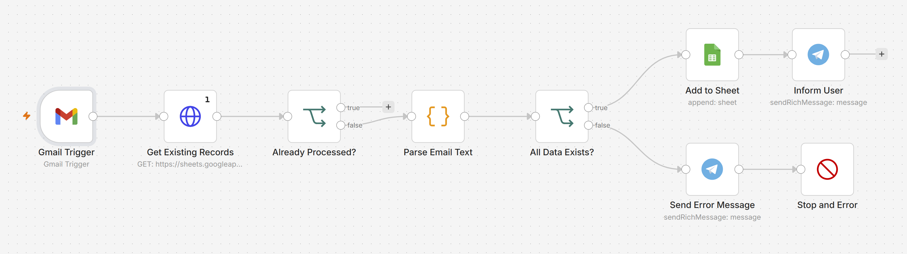
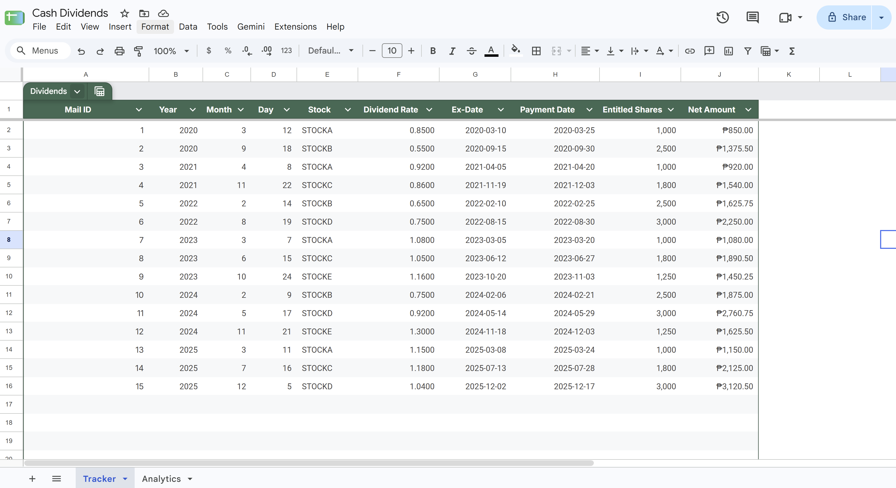
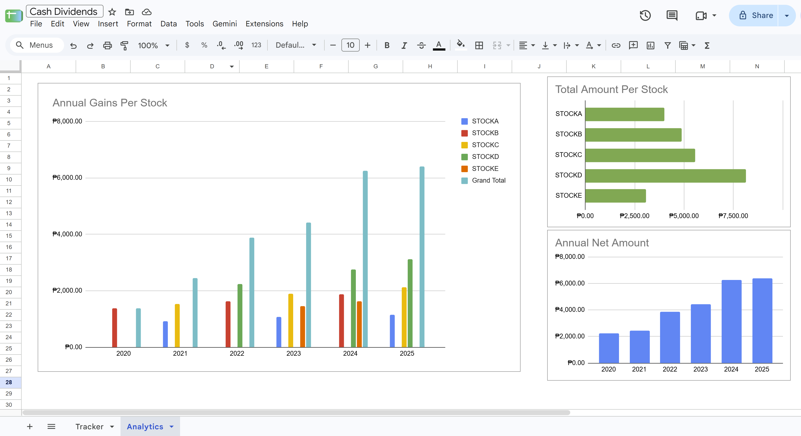
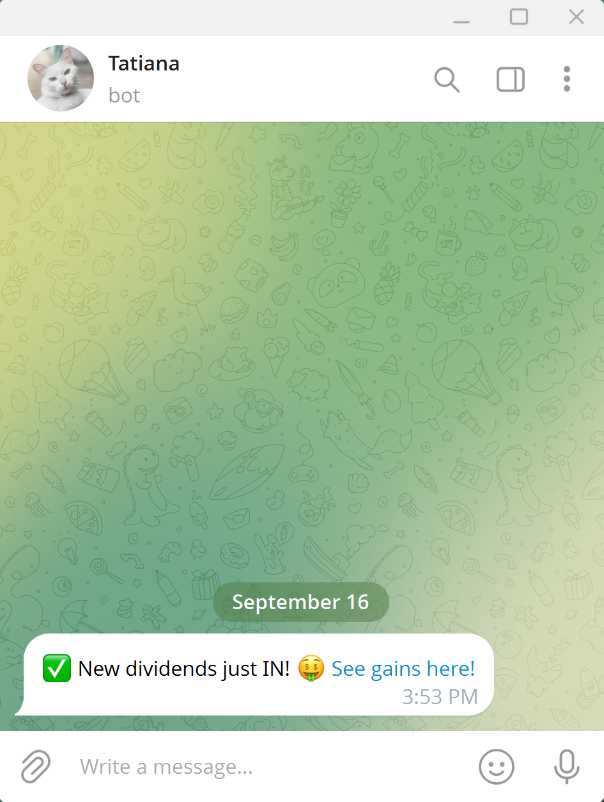
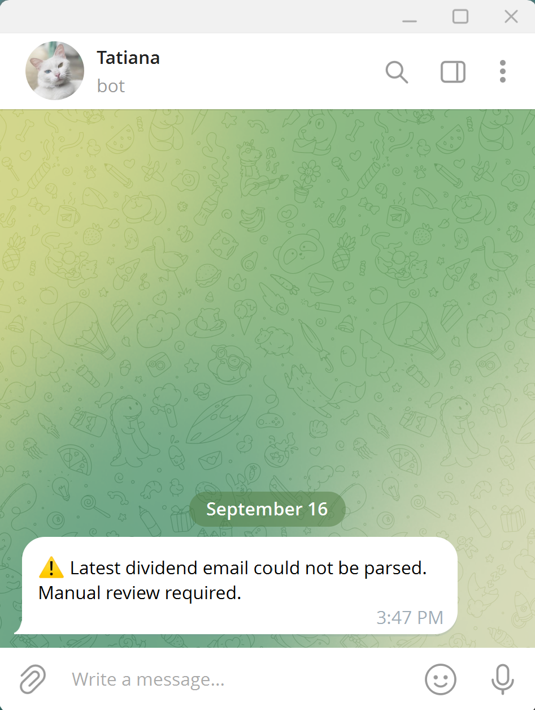
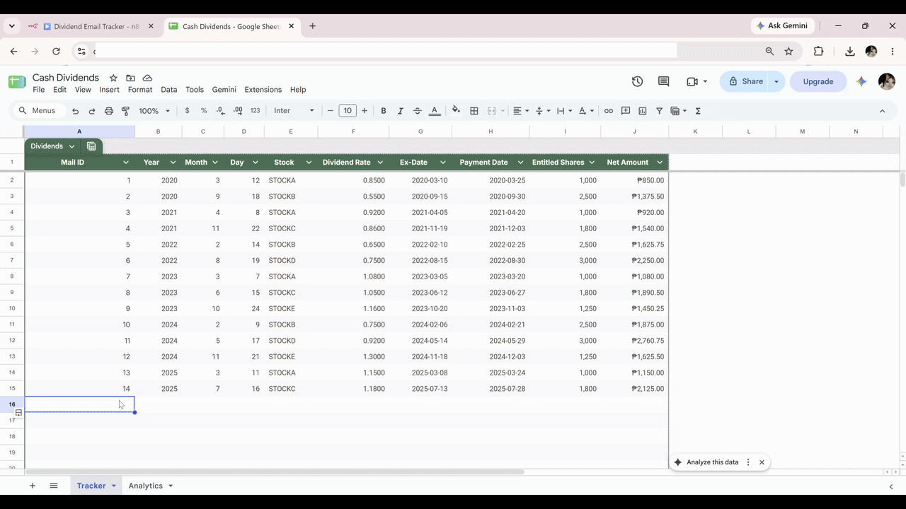
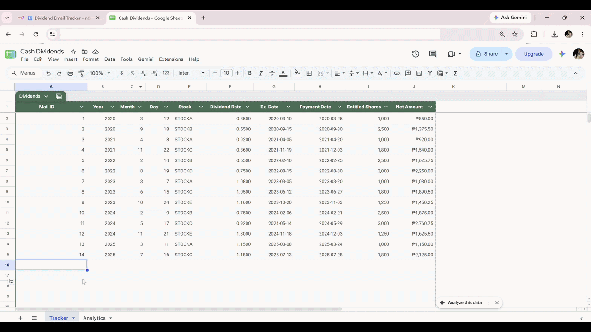
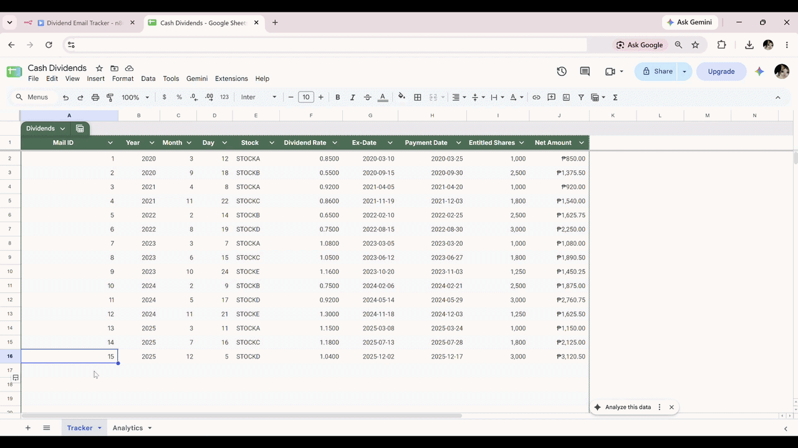

# Dividend Email Tracker

An n8n automation that extracts dividend payment information from Gmail notifications, records it in Google Sheets, and sends a notification through Telegram.

## Problem

I receive dividend notification emails whenever one of my stocks pays a cash dividend. I originally had to manually go through these emails, record the relevant information, and calculate my dividend income.

As the number of dividend payments increased, this became tedious and made it easier to miss entries or accidentally record the same dividend more than once.

## Solution

This workflow automates the process by:

1. Fetching dividend notification emails from Gmail
2. Extracting and sanitizing the relevant information
3. Checking the Gmail message ID to prevent duplicate entries
4. Validating the extracted data before saving it
5. Recording valid data in Google Sheets
6. Updating an Analysis sheet with charts for visualization
7. Sending Telegram notifications for successful processing
8. Sending Telegram error notifications when an email cannot be processed

This allows me to maintain my dividend records automatically while also giving me a visual overview of my dividend income.

## Screenshots

### n8n Workflow

### Tracker Sheet

### Analytics Sheet

### Telegram Bot
| ✅ Success Message  | ⚠️ Error Message |
| ------- | ----- |
|  |    |

## Demo

### Case 1: Successful Processing
All required data is extracted and parsed correctly. 

Adds a row in Tracker Sheet.

### Case 2: Changed Email Format
Detects missing data caused by a changed email format and triggers an error notification. 

No changes to the Tracker Sheet.

### Case 3: Duplicate Email
Detects and skips already processed emails. 

No changes to the Tracker Sheet.

## Tools Used

* **n8n** – Workflow automation
* **Gmail API** – Retrieve dividend notification emails
* **Google Sheets API** – Store and check processed email data
* **Telegram Bot API** – Send dividend notifications
* **JavaScript** – Data extraction and sanitization
